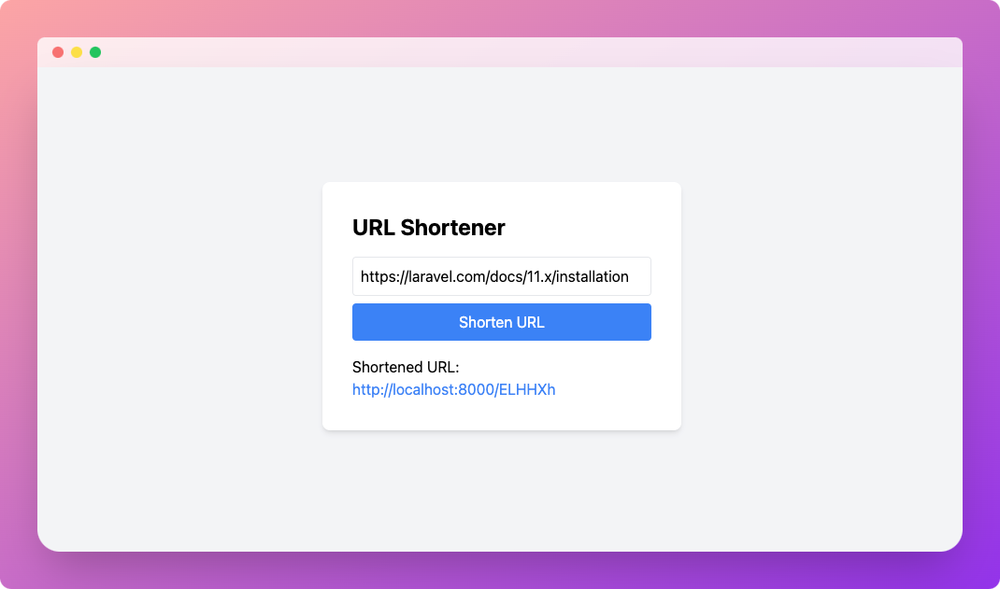

# Laravel URL Shortener with Neon Postgres

This project is a simple URL shortener built with Laravel and Neon Postgres, demonstrating the use of read replicas for improved performance and scalability.

## Features

-   Shorten long URLs to easily shareable short links
-   Redirect users from short links to original URLs
-   Utilizes Neon Postgres read replicas for efficient read operations

## Requirements

-   PHP
-   Composer
-   Laravel
-   PostgreSQL
-   Neon account for database hosting

## Installation

1. Clone the repository:

    ```bash
    git clone https://github.com/dhanushreddy291/neon-read-replica-laravel
    cd neon-read-replica-laravel
    ```

2. Install dependencies:

    ```bash
    composer install
    ```

3. Copy the `.env.example` file to `.env` and configure your Neon database credentials:

    ```bash
    cp .env.example .env
    ```

4. Update the following variables in `.env`:

    ```
    DB_CONNECTION=pgsql
    DB_READ_HOST=your-neon-read-replica-host
    DB_WRITE_HOST=your-neon-primary-host
    DB_PORT=5432
    DB_DATABASE=your-database-name
    DB_USERNAME=your-username
    DB_PASSWORD=your-password
    ```

5. Run database migrations:
    ```bash
    php artisan migrate
    ```

## Usage

1. Start the Laravel development server:

    ```bash
    php artisan serve
    ```

2. Open your browser and navigate to `http://localhost:8000`

3. Enter a long URL in the input field and click "Shorten URL" to create a short link

4. Use the generated short link to access the original URL



## Learn More

-   [PHP](https://www.php.net/)
-   [Laravel Documentation](https://laravel.com/docs)
-   [Neon Postgres Documentation](https://neon.tech/docs/introduction)

## Contributing

Contributions are welcome! Please feel free to submit a Pull Request.
